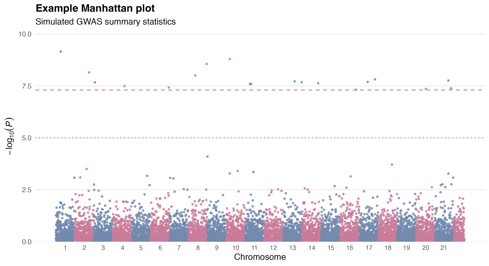
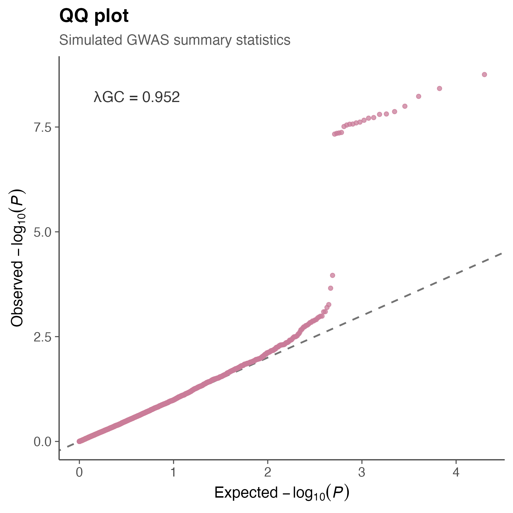
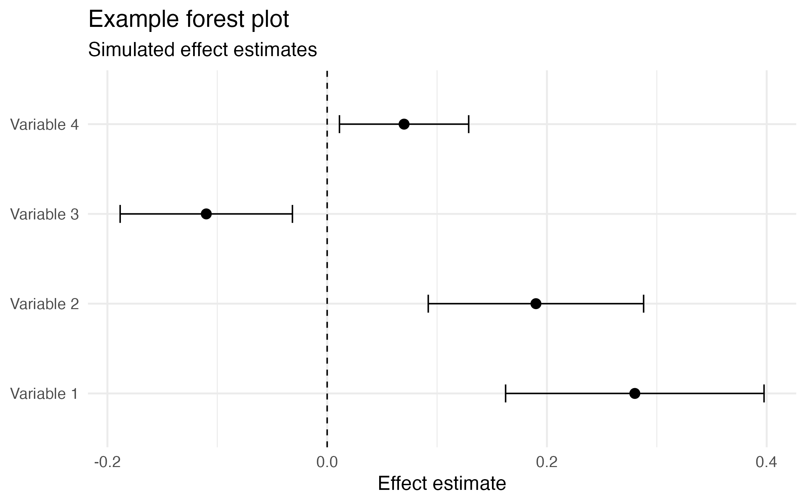

# genetic-data-visualization
Plots for statistical genetics and bioinformatics

## Included visualizations

- Manhattan plots

- QQ plots

- Forest plots

This repository contains reproducible R scripts and example figures

## Tools

- R
- ggplot2
- dplyr
- data.table

## Author

Natalia Llonga  
PhD Student in Genetics
